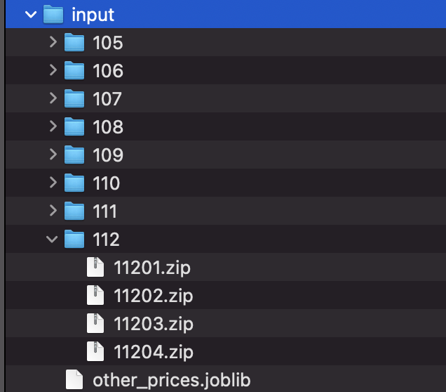

# tbrain_2023_fall_sinopac_house_price_prediction
the 4th place solution for 2023 fall Sinopac bank House Price prediction

# 設定

## 加入input資料夾
因為壓縮檔裡面沒有包含資料，所以這邊需要使用者自行添加，裡面的格式如下:

分別為105~112年的實價登錄資料，打開每一個子資料夾，裡面都會有4個zip檔案，例如11201.zip代表112年第一季的資料，詳細的下載位置可以參考說明文件，而other_prices.joblib會在之後執行自動產生

## 加入train_data資料夾
接下來要設定train_data資料夾的東西，裡面擺放的是主辦方所提供的資料，其中外部資料的部分，放在子資料夾external_data，其餘檔案擺放在train_data裡面第一層

## 設定虛擬環境
只要可以執行main.py就可以產生submission.csv，這邊可以開一個python3.9.16的虛擬環境然後
```bash
pip install -r requirements.txt
```

## 執行
安裝完相關依賴套件後，就用環境的python執行main.py，就可以在專案資料夾產生submission.csv
